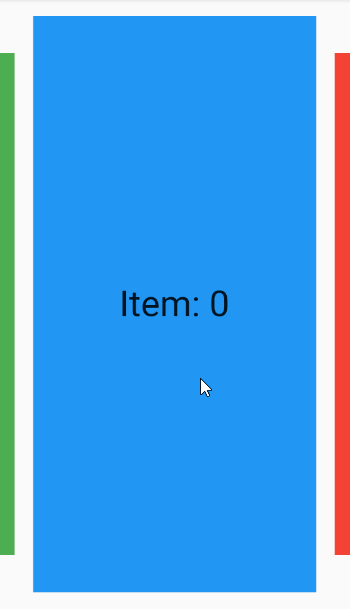

# adbonnin_flutter_carousel

A carousel widget for Flutter.

## Features

* Infinite scroll
* Horizontal or vertical scrolling
* Customizable transition

## Supported platforms

* Flutter Android
* Flutter iOS
* Flutter web
* Flutter desktop

## Live preview

https://adbonnin.github.io/flutter_carousel

Basic carousel example:



## Installation

Add `adbonnin_flutter_carousel: ^0.0.1` to your `pubspec.yaml` dependencies :

```yaml
dependencies:
  adbonnin_flutter_carousel: ^0.0.1
```

Import it :

```dart
import 'package:adbonnin_flutter_carousel/adbonnin_flutter_carousel.dart';
```

## How to use

Create a `Carousel` widget with some `children` :

```dart
class BasicExample extends StatelessWidget {
  @override
  Widget build(BuildContext context) {
    return Padding(
      padding: EdgeInsets.only(top: 20, bottom: 20),
      child: Carousel(
        children: [
          TextItem(0),
          TextItem(1),
          TextItem(2),
          TextItem(3),
        ],
      ),
    );
  }
}
```
